# Heart Disease Prediction Using Data Mining and Machine Learning Classification Models

**Data Mining Mini Project Report**

**Student Name:** [Your Name]  
**Course:** Data Mining  
**Instructor:** [Instructor Name]  
**Date:** [Submission Date]

\pagebreak

## Abstract

Heart disease is a major health problem, and early prediction can support faster medical decision-making. This project applies data mining and machine learning classification methods to predict whether a patient has heart disease using the UCI Heart Disease dataset. The original multiclass diagnosis was converted into a binary target, where `0` represents no heart disease and `1` represents heart disease. The cleaned dataset contains 920 patient records, 15 columns, and no missing values. The project follows a complete data mining workflow: data cleaning, stratified train/test splitting, exploratory data analysis, feature engineering, baseline comparison, dimensionality reduction using PCA, model training, cross-validation, and final model evaluation. Four supervised learning models were compared: K-Nearest Neighbors, Logistic Regression, Decision Tree, and Random Forest. The results show that KNN achieved the highest accuracy, recall, and F1-score, while Logistic Regression achieved the highest ROC-AUC and provided strong interpretability. These results show that simple, well-preprocessed models can perform strongly on structured clinical data.

## Table of Contents

1. Introduction  
2. Problem Statement  
3. Dataset Description  
4. Data Cleaning  
5. Train/Test Split Strategy  
6. Exploratory Data Analysis  
7. Feature Engineering  
8. Feature Importance Discussion  
9. Baseline Comparison  
10. Dimensionality Reduction Using PCA  
11. Experiment Without Dataset Source Feature  
12. Machine Learning Models  
13. Experimental Setup  
14. Results and Discussion  
15. Model Comparison  
16. Conclusion  
17. Future Work  
18. References

\pagebreak

## 1. Introduction

Heart disease prediction is a useful classification problem in healthcare data mining. Medical datasets often contain patient information such as age, cholesterol level, resting blood pressure, chest pain type, maximum heart rate, and exercise-related symptoms. By learning patterns from these features, machine learning models can estimate whether a patient is likely to have heart disease.

The purpose of this project is to build and evaluate a complete machine learning workflow for heart disease prediction. The project does not attempt to replace medical professionals. Instead, it demonstrates how data mining techniques can be used as a decision-support tool for early risk prediction.

The main contribution of this project is that it does not only train models. It also includes proper data preparation, leakage prevention, cross-validation, baseline comparison, PCA dimensionality reduction, feature importance analysis, and an additional experiment to check whether the dataset source feature affects model performance.

## 2. Problem Statement

The task is a binary classification problem:

```text
Predict whether a patient has heart disease or not.
```

The target variable is:

```text
0 = No heart disease
1 = Heart disease
```

The main research question is:

```text
Which machine learning classification model performs best for predicting heart disease on this cleaned and preprocessed dataset?
```

The secondary questions are:

1. Do the machine learning models perform better than a simple baseline classifier?
2. Does PCA improve model performance?
3. Are the results strongly affected by the dataset source feature?
4. Which medical features appear most important for prediction?

## 3. Dataset Description

The dataset used in this project is based on the UCI Heart Disease dataset. The UCI repository describes the task as a classification problem and states that the goal field represents the presence of heart disease, with values from `0` for absence to `1-4` for presence. In this project, those values were converted into a binary target.

The cleaned dataset contains records from multiple UCI heart disease sources, including Cleveland, Hungary, Switzerland, and VA Long Beach.

| Item | Value |
| --- | ---: |
| Rows | 920 |
| Columns | 15 |
| Missing values after cleaning | 0 |
| Target classes | 2 |

The final cleaned columns are shown below.

| Feature | Description |
| --- | --- |
| `age` | Patient age |
| `sex` | Patient sex |
| `dataset` | Source dataset location |
| `cp` | Chest pain type |
| `trestbps` | Resting blood pressure |
| `chol` | Serum cholesterol |
| `fbs` | Fasting blood sugar |
| `restecg` | Resting ECG result |
| `thalch` | Maximum heart rate achieved |
| `exang` | Exercise-induced angina |
| `oldpeak` | ST depression induced by exercise |
| `slope` | Slope of peak exercise ST segment |
| `ca` | Number of major vessels |
| `thal` | Thalassemia result |
| `target` | Binary heart disease diagnosis |

The target distribution was reasonably balanced, with 411 patients in class `0` and 509 patients in class `1`.

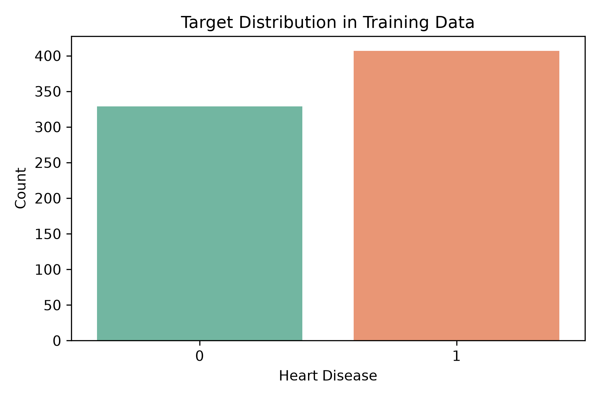

**Figure 1.** Target distribution after converting the original diagnosis into binary classification.

## 4. Data Cleaning

The raw dataset required cleaning before model training. The main data cleaning steps were:

1. Loaded the original heart disease dataset.
2. Checked rows, columns, missing values, and duplicates.
3. Removed irrelevant columns such as `id`.
4. Converted the original diagnosis column into a binary `target` variable.
5. Filled missing numerical values using median values.
6. Filled missing categorical values using mode values.
7. Cleaned and standardized categorical text values.
8. Saved the cleaned dataset as `data/processed/heart_cleaned.csv`.

After cleaning, the dataset contained 920 rows, 15 columns, and 0 missing values.

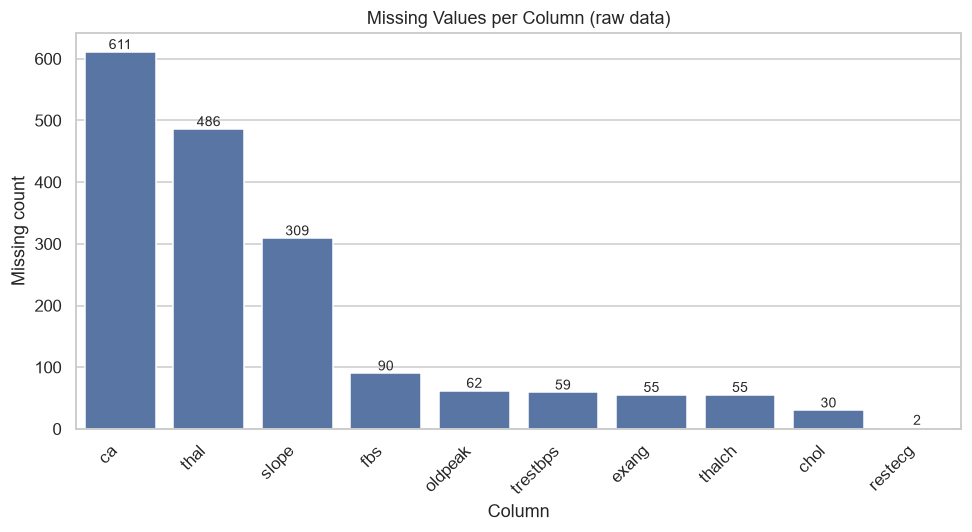

**Figure 2.** Missing value check after the cleaning process.

## 5. Train/Test Split Strategy

The cleaned dataset was split before feature engineering and model training. This is important because preprocessing steps such as scaling, encoding, and PCA must not learn from the test set.

A stratified 80/20 split was used with random state `42`.

| Split | Rows | Target 0 | Target 1 |
| --- | ---: | ---: | ---: |
| Training | 736 | 329 | 407 |
| Testing | 184 | 82 | 102 |

The training set was used for cross-validation and model selection. The test set was kept untouched until final evaluation.

This design improves the reliability of the experiment because the final test metrics estimate how the models perform on unseen data.

## 6. Exploratory Data Analysis

EDA was performed on the training data only. The goal was to understand important patterns before modeling.

### 6.1 Numerical Features

The numerical features were:

```text
age, trestbps, chol, thalch, oldpeak
```

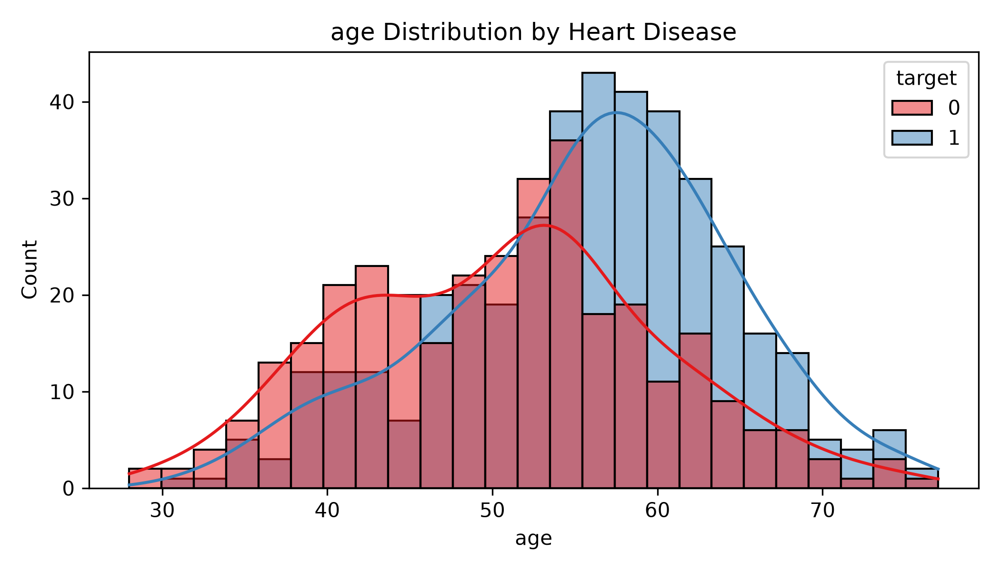

**Figure 3.** Age distribution for patients with and without heart disease.

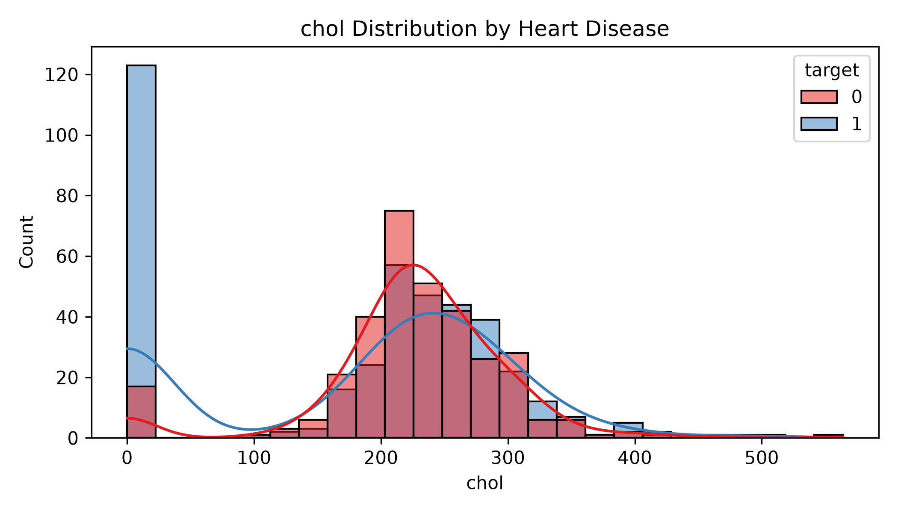

**Figure 4.** Serum cholesterol distribution by target class.

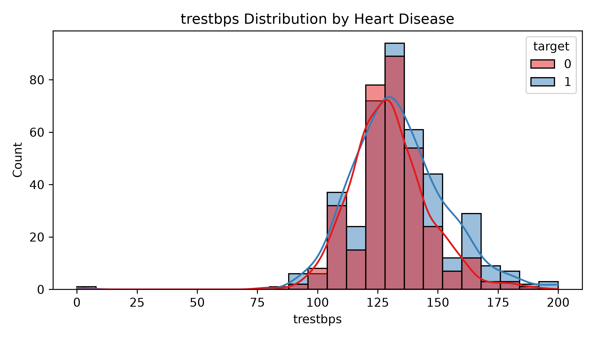

**Figure 5.** Resting blood pressure distribution by target class.

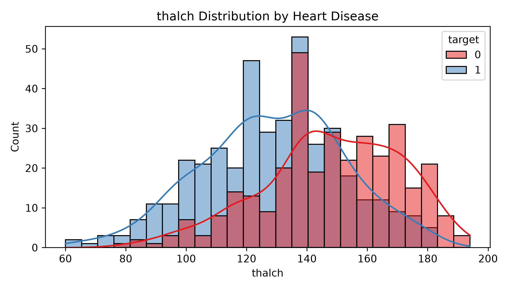

**Figure 6.** Maximum heart rate achieved by target class.

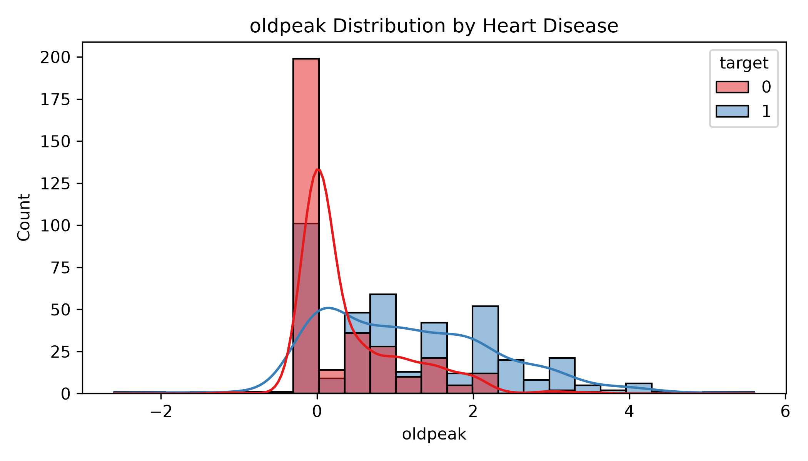

**Figure 7.** ST depression induced by exercise compared across target classes.

### 6.2 Categorical Features

The categorical features were:

```text
sex, dataset, cp, restecg, slope, thal
```

Chest pain type was especially informative. Patients with asymptomatic chest pain were more commonly associated with heart disease.

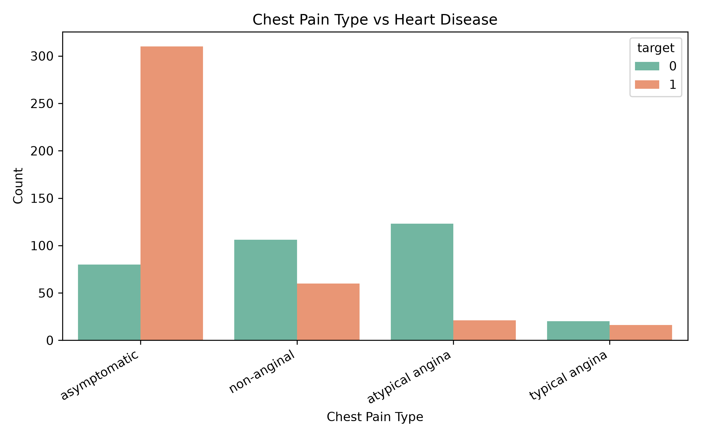

**Figure 8.** Chest pain type distribution across target classes.

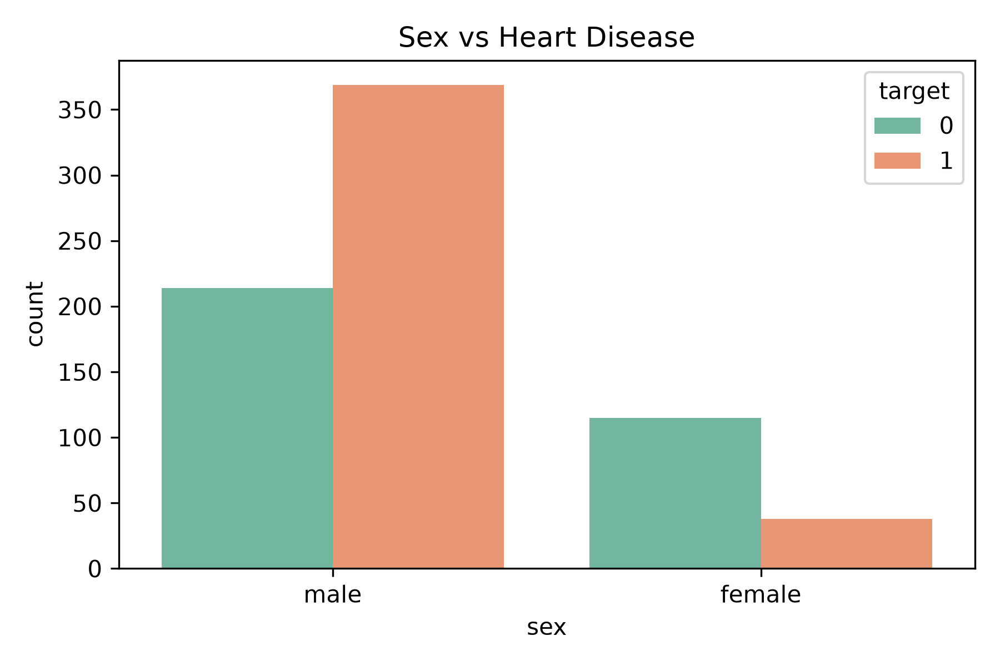

**Figure 9.** Sex distribution across target classes.

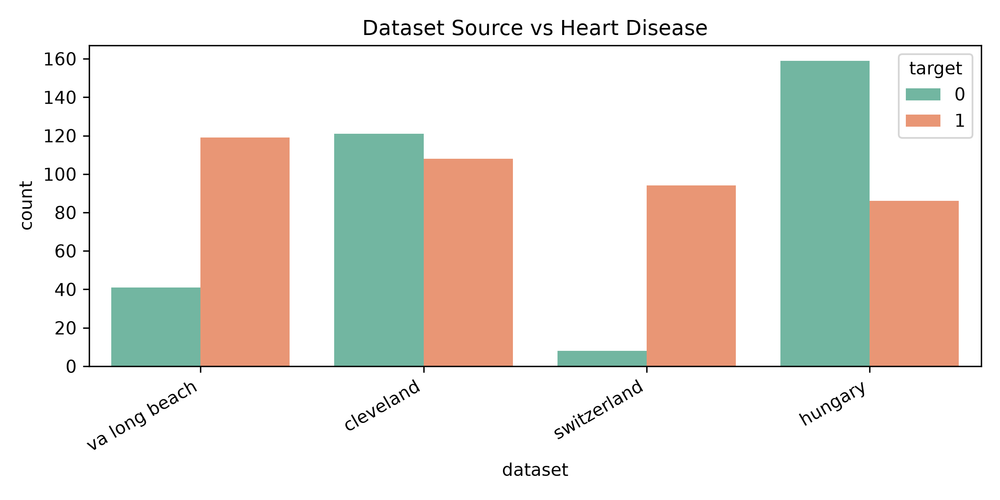

**Figure 10.** Target distribution across dataset sources.

### 6.3 Correlation Analysis

A correlation heatmap was created after encoding categorical variables. It helped show relationships between processed features and the target variable.

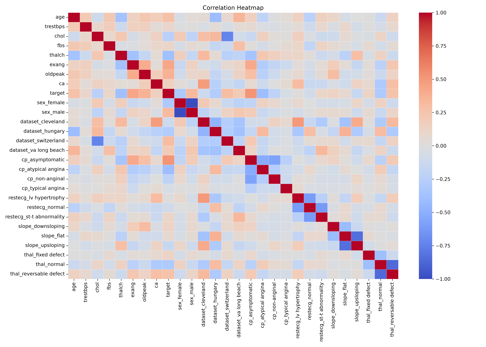

**Figure 11.** Correlation heatmap for processed training features.

## 7. Feature Engineering

Feature engineering converted the cleaned dataset into a format suitable for machine learning.

| Feature group | Features | Processing method |
| --- | --- | --- |
| Numerical | `age`, `trestbps`, `chol`, `thalch`, `oldpeak` | StandardScaler |
| Categorical | `sex`, `dataset`, `cp`, `restecg`, `slope`, `thal` | OneHotEncoder |
| Binary/discrete | `fbs`, `exang`, `ca` | Passthrough |

The preprocessing pipeline was fitted only on `X_train`. The same fitted pipeline was then used to transform both `X_train` and `X_test`. This avoids data leakage and keeps the evaluation fair.

## 8. Feature Importance Discussion

Feature importance was interpreted using Random Forest feature importance and Logistic Regression coefficients.

The strongest Random Forest features were:

| Rank | Feature | Importance |
| ---: | --- | ---: |
| 1 | `cp_asymptomatic` | 0.1168 |
| 2 | `oldpeak` | 0.1068 |
| 3 | `thalch` | 0.0971 |
| 4 | `chol` | 0.0940 |
| 5 | `age` | 0.0814 |
| 6 | `exang` | 0.0734 |
| 7 | `trestbps` | 0.0590 |

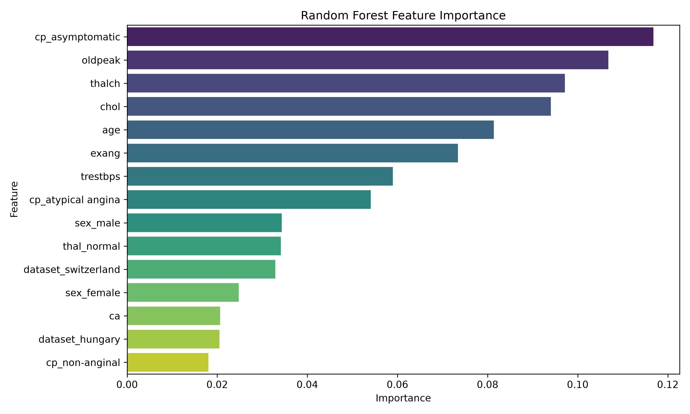

**Figure 12.** Top features ranked by the Random Forest model.

These features are reasonable for a heart disease prediction task. Chest pain type, ST depression, maximum heart rate, cholesterol, age, exercise-induced angina, and resting blood pressure are all medically meaningful variables.

Logistic Regression also highlighted important features such as `cp_asymptomatic`, `exang`, `ca`, `oldpeak`, and `thal_normal`. Some dataset-source features also appeared with high coefficient values, which motivated the additional experiment without dataset source columns.

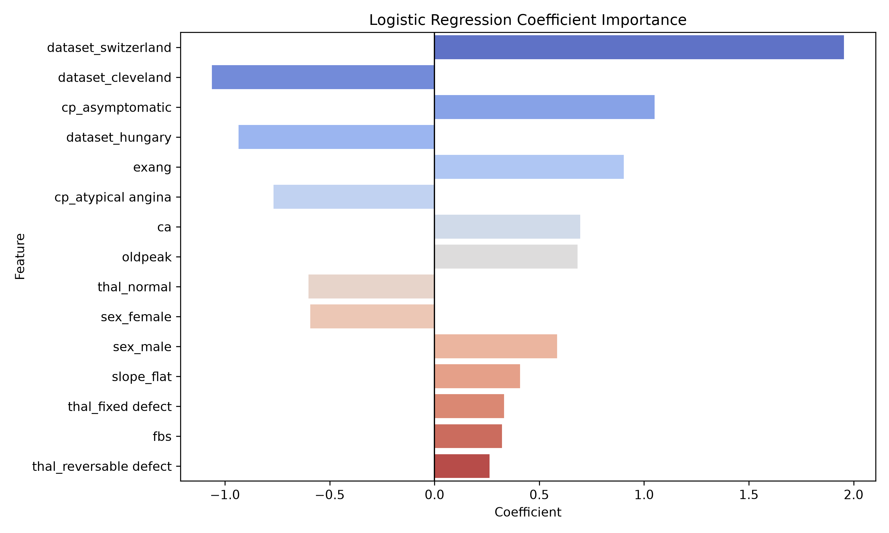

**Figure 13.** Logistic Regression coefficients ranked by absolute coefficient size.

## 9. Baseline Comparison

A DummyClassifier baseline was trained using the most frequent class strategy. This model ignores all input features and always predicts the majority class. The baseline is useful because it shows whether the machine learning models actually learn useful patterns.

| Model | Accuracy | Precision | Recall | F1 | ROC-AUC | CV Mean | CV Std |
| --- | ---: | ---: | ---: | ---: | ---: | ---: | ---: |
| Dummy Baseline | 0.554 | 0.554 | 1.000 | 0.713 | 0.500 | 0.553 | 0.003 |

The baseline recall is 1.000 because the majority class is heart disease, so the baseline predicts class `1` for every patient. However, its ROC-AUC is only 0.500, which means it has no real ability to separate patients with and without heart disease. All trained machine learning models performed better than this baseline overall.

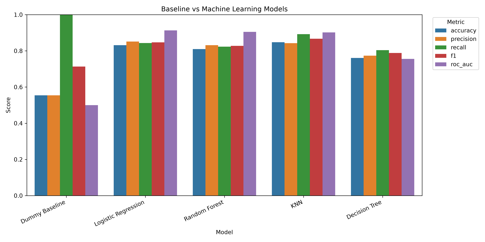

**Figure 14.** Dummy baseline compared with the trained machine learning models.

## 10. Dimensionality Reduction Using PCA

Principal Component Analysis was tested as a dimensionality reduction method. PCA was fitted only on the training data, then the fitted PCA transformation was applied to the test data.

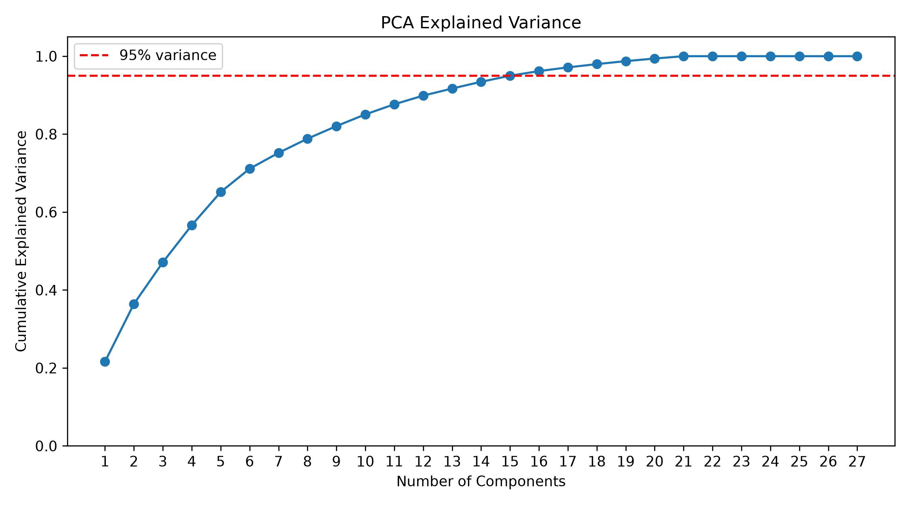

**Figure 15.** Cumulative explained variance from PCA components.

The PCA results were:

| Model | Accuracy | Precision | Recall | F1 | ROC-AUC | CV Mean | CV Std |
| --- | ---: | ---: | ---: | ---: | ---: | ---: | ---: |
| KNN | 0.842 | 0.835 | 0.892 | 0.863 | 0.912 | 0.827 | 0.022 |
| Logistic Regression | 0.826 | 0.843 | 0.843 | 0.843 | 0.898 | 0.814 | 0.032 |
| Random Forest | 0.832 | 0.832 | 0.873 | 0.852 | 0.894 | 0.831 | 0.024 |
| Decision Tree | 0.766 | 0.792 | 0.784 | 0.788 | 0.764 | 0.751 | 0.019 |

PCA did not improve the best overall ROC-AUC compared with the original processed features. Therefore, the original processed feature set was kept as the main modeling approach.

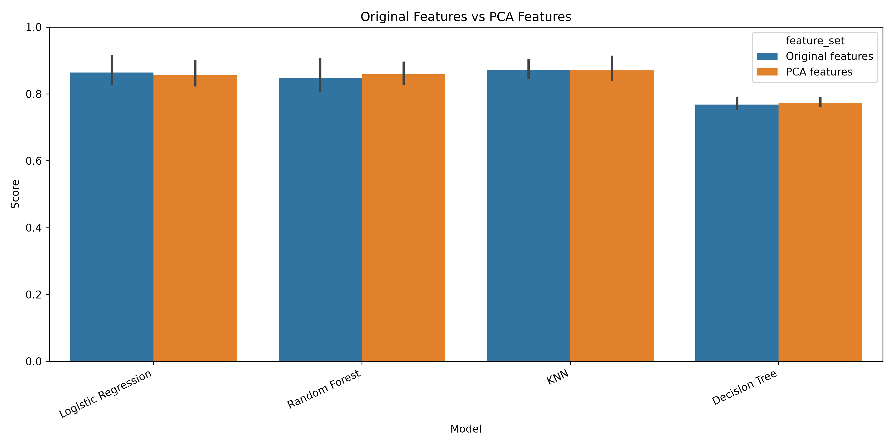

**Figure 16.** Model performance using original processed features compared with PCA-transformed features.

## 11. Experiment Without Dataset Source Feature

The encoded dataset source columns were removed to check whether the models depended too strongly on source location. The removed columns were:

```text
dataset_cleveland
dataset_hungary
dataset_switzerland
dataset_va long beach
```

The results were:

| Model | Accuracy | Precision | Recall | F1 | ROC-AUC | CV Mean | CV Std |
| --- | ---: | ---: | ---: | ---: | ---: | ---: | ---: |
| Random Forest | 0.826 | 0.824 | 0.873 | 0.848 | 0.893 | 0.832 | 0.029 |
| Logistic Regression | 0.815 | 0.827 | 0.843 | 0.835 | 0.893 | 0.804 | 0.042 |
| KNN | 0.821 | 0.805 | 0.892 | 0.847 | 0.877 | 0.833 | 0.023 |
| Decision Tree | 0.761 | 0.774 | 0.804 | 0.788 | 0.756 | 0.760 | 0.021 |

The performance dropped moderately, but the models still performed clearly above the baseline. This suggests that the prediction was not based only on dataset source; the medical features still contained useful predictive information.

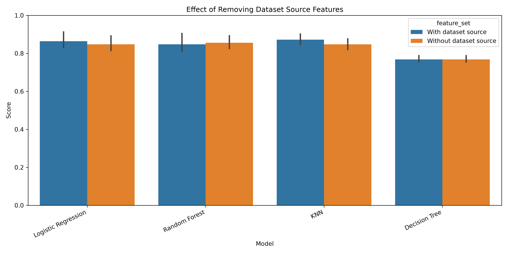

**Figure 17.** Performance comparison with and without dataset source features.

## 12. Machine Learning Models

Four supervised classification models were trained and evaluated.

### 12.1 K-Nearest Neighbors

KNN classifies a patient using the labels of the most similar patients in the training set. Values of `k` from 1 to 20 were tested using 5-fold cross-validation. The best value was:

```text
k = 7
```

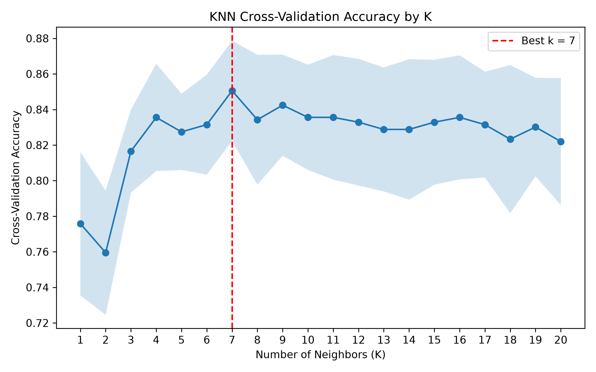

**Figure 18.** Cross-validation accuracy for KNN values from 1 to 20.

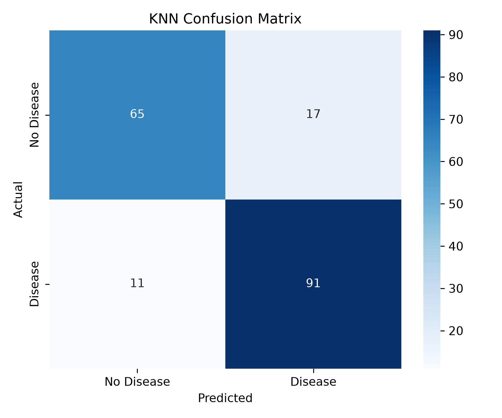

**Figure 19.** KNN confusion matrix on the untouched test set.

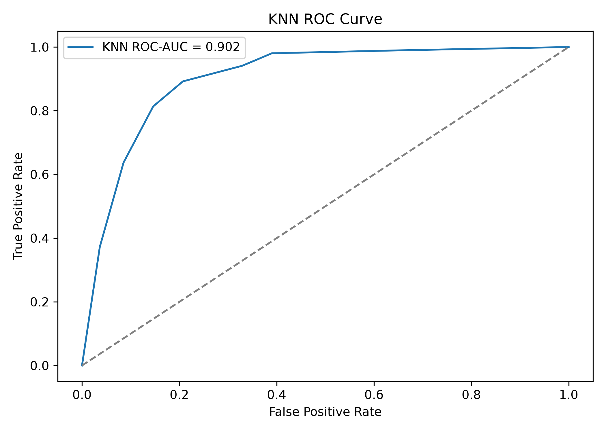

**Figure 20.** KNN ROC curve on the untouched test set.

### 12.2 Logistic Regression

Logistic Regression was included because it is a strong and interpretable model for binary classification. It achieved the highest ROC-AUC score, meaning it separated the two classes better across probability thresholds.

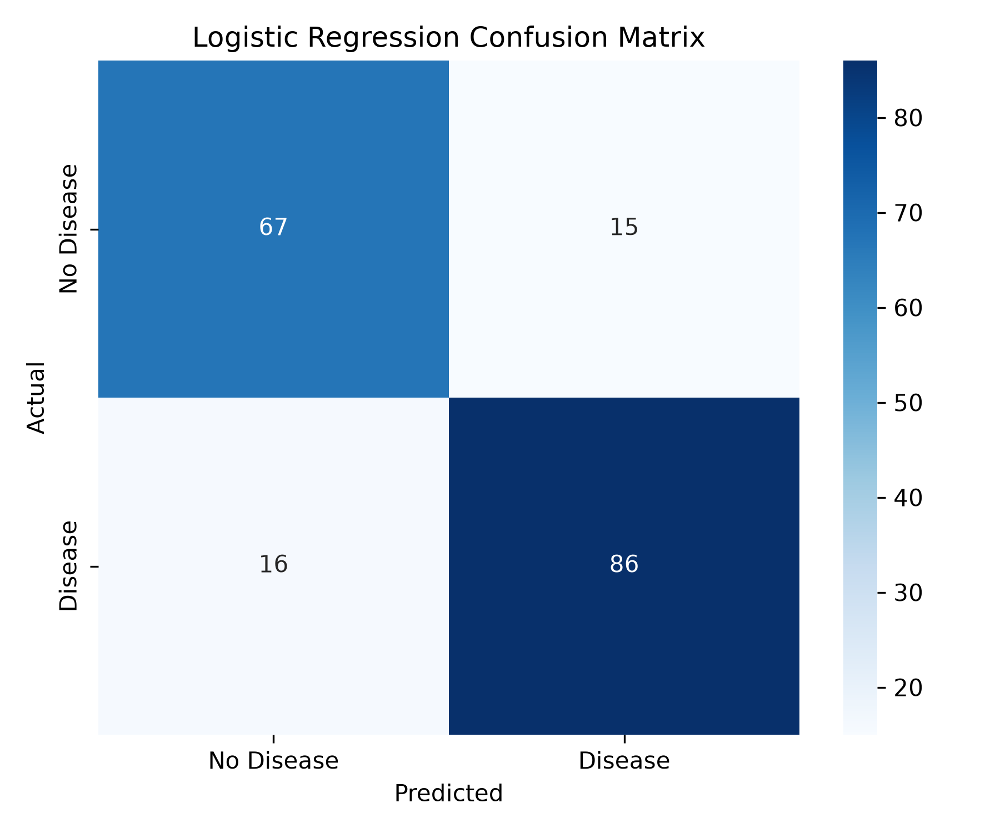

**Figure 21.** Logistic Regression confusion matrix on the untouched test set.

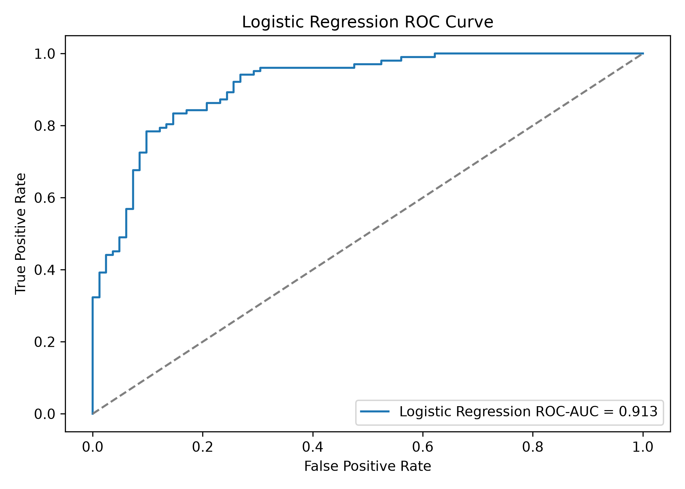

**Figure 22.** Logistic Regression ROC curve on the untouched test set.

### 12.3 Decision Tree

Decision Tree was included because it is easy to visualize and explain. It had the weakest performance among the trained models, which is reasonable because a single tree can be less stable than an ensemble model.

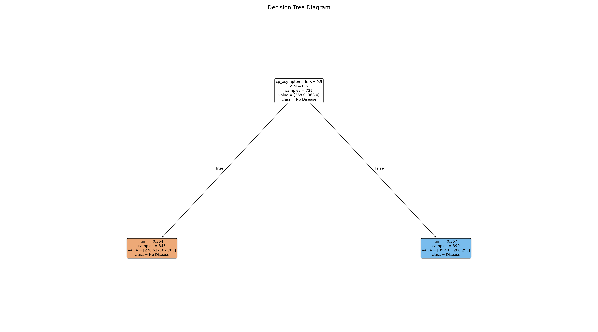

**Figure 23.** Visualized Decision Tree model.

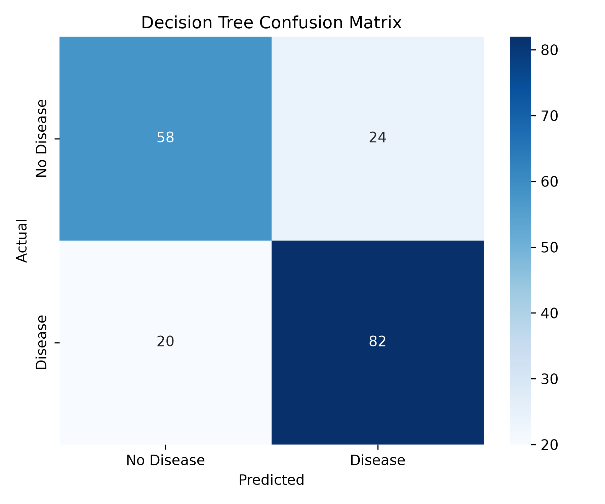

**Figure 24.** Decision Tree confusion matrix on the untouched test set.

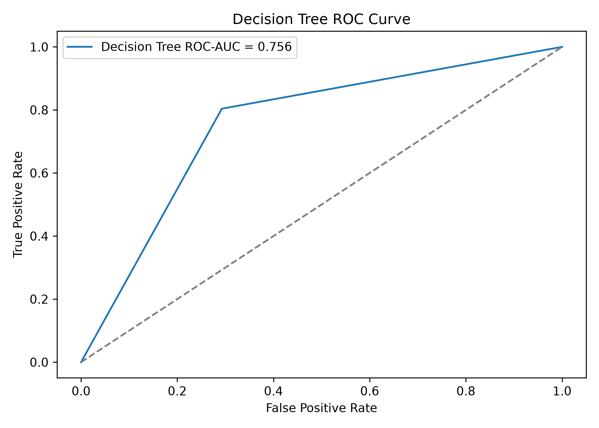

**Figure 25.** Decision Tree ROC curve on the untouched test set.

### 12.4 Random Forest

Random Forest was included as the ensemble model. GridSearchCV was used to tune the model on the training set. The best parameters were:

```text
max_depth = 10
min_samples_leaf = 1
min_samples_split = 2
n_estimators = 300
```

Random Forest performed strongly and provided useful feature importance results, but it did not outperform KNN or Logistic Regression on the main test metrics.

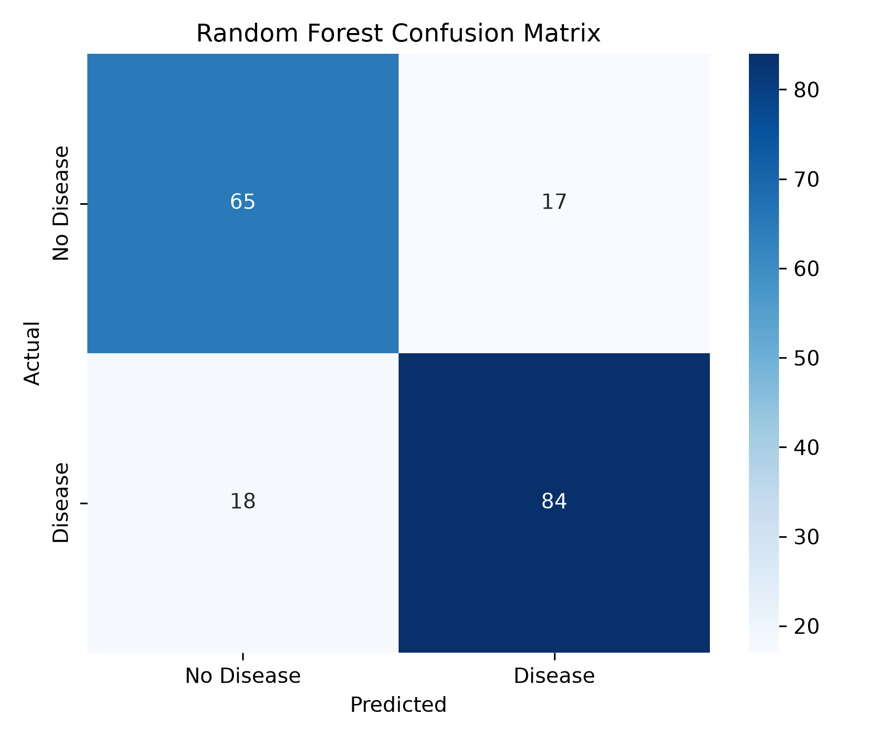

**Figure 26.** Random Forest confusion matrix on the untouched test set.

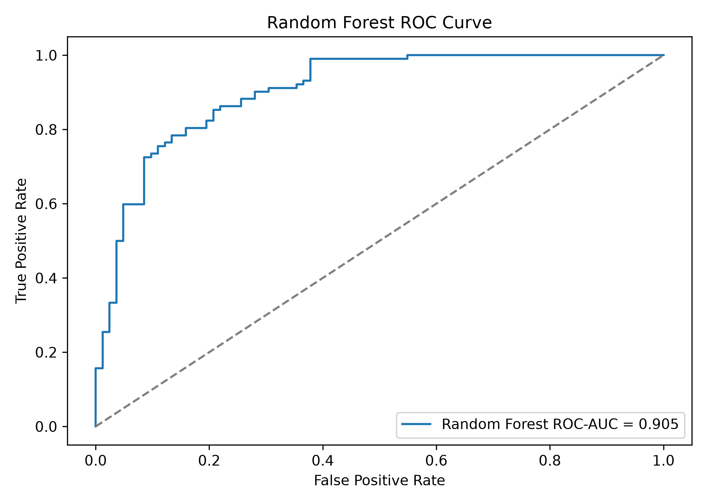

**Figure 27.** Random Forest ROC curve on the untouched test set.

## 13. Experimental Setup

The experiment followed these rules:

1. Data was cleaned before modeling.
2. The train/test split was performed before model training.
3. The test set was kept untouched until final evaluation.
4. Cross-validation was performed only on the training set.
5. Hyperparameter selection was based on cross-validation.
6. Encoders and scalers were fitted only on training data.
7. PCA was fitted only on training data.
8. Final results were reported using the untouched test set.

The evaluation metrics were:

```text
Accuracy
Precision
Recall
F1-score
ROC-AUC
Cross-validation mean score
Cross-validation standard deviation
```

## 14. Results and Discussion

The final model comparison is shown below.

| Model | Accuracy | Precision | Recall | F1 | ROC-AUC | CV Mean | CV Std |
| --- | ---: | ---: | ---: | ---: | ---: | ---: | ---: |
| Logistic Regression | 0.832 | 0.851 | 0.843 | 0.847 | 0.913 | 0.827 | 0.035 |
| Random Forest | 0.810 | 0.832 | 0.824 | 0.828 | 0.905 | 0.833 | 0.036 |
| KNN | 0.848 | 0.843 | 0.892 | 0.867 | 0.902 | 0.851 | 0.028 |
| Decision Tree | 0.761 | 0.774 | 0.804 | 0.788 | 0.756 | 0.760 | 0.021 |

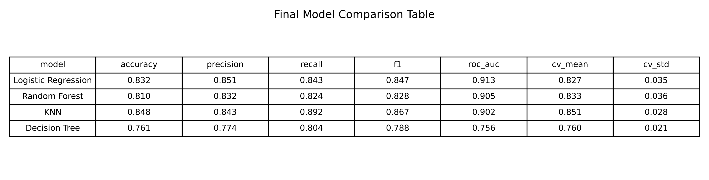

**Figure 28.** Final test-set model comparison table.

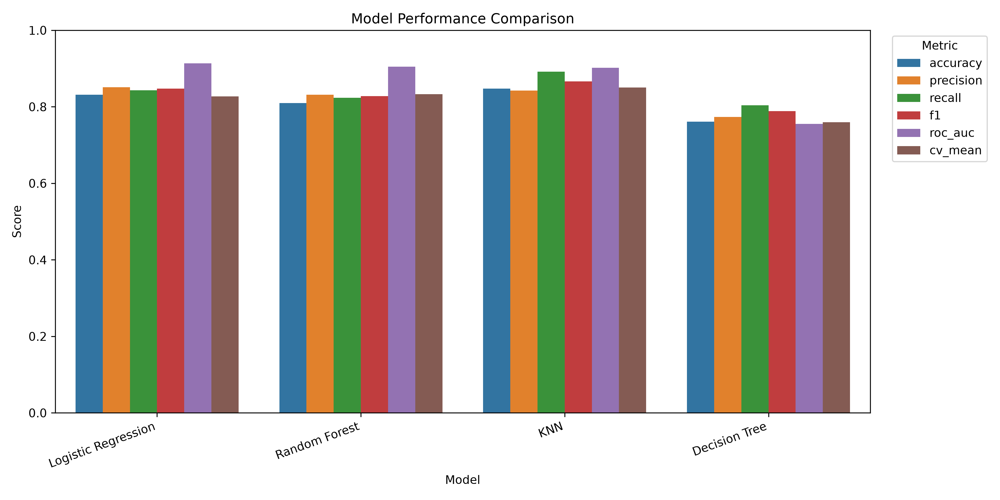

**Figure 29.** Comparison of model performance across evaluation metrics.

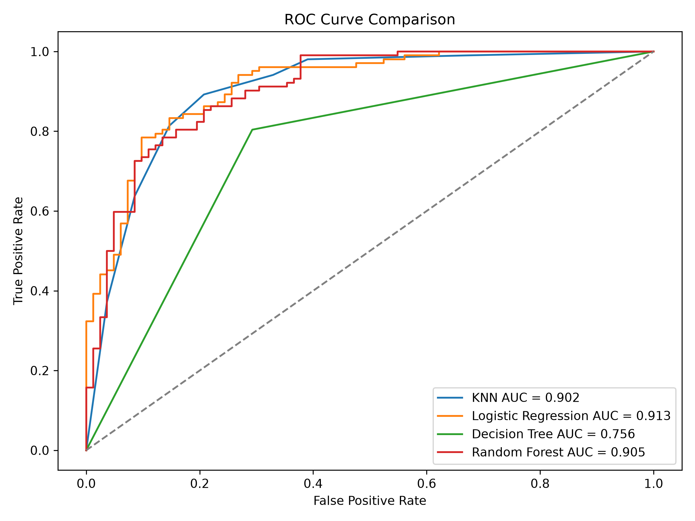

**Figure 30.** ROC curve comparison for all trained models.

KNN achieved the highest accuracy, recall, and F1-score. This is important because recall is especially meaningful in a medical prediction task: a false negative means the model predicts no heart disease when the patient may actually have heart disease.

Logistic Regression achieved the highest ROC-AUC. This indicates that it had the best overall class-separation ability across different probability thresholds. It is also highly interpretable because its coefficients show the direction and strength of feature effects.

Random Forest was expected to perform very strongly because it is a more complex ensemble model. However, it did not outperform the simpler models. This result is still reasonable. The dataset is relatively small, structured, and well-preprocessed, so simple models can capture the main patterns effectively. Complex models do not always win, especially when the feature space is clean and the sample size is limited.

Decision Tree performed weakest. This is expected because a single tree can be more sensitive to small changes in the data and may not generalize as well as Random Forest.

## 15. Model Comparison

The best model depends on the priority.

| Priority | Best Model | Reason |
| --- | --- | --- |
| Highest accuracy | KNN | Accuracy = 0.848 |
| Highest recall | KNN | Recall = 0.892 |
| Highest F1-score | KNN | F1 = 0.867 |
| Highest ROC-AUC | Logistic Regression | ROC-AUC = 0.913 |
| Best interpretability | Logistic Regression | Coefficients can be explained |
| Best feature importance analysis | Random Forest | Provides ranked feature importances |

For this project, KNN can be justified as the best predictive model because it achieved the highest accuracy, recall, and F1-score. Logistic Regression can be justified as the strongest interpretable model because it achieved the highest ROC-AUC and provides clear coefficients.

## 16. Conclusion

This project successfully applied a complete data mining workflow to heart disease prediction. The dataset was cleaned, split correctly, explored through EDA, transformed using a preprocessing pipeline, and evaluated using multiple classification models.

The DummyClassifier baseline confirmed that the trained machine learning models performed better than a naive majority-class classifier. PCA was tested as a dimensionality reduction method, but the original processed features remained better for final modeling. The experiment without dataset source features showed that the models still performed well using medical features, although some performance was lost.

The final results showed that KNN achieved the best accuracy, recall, and F1-score, while Logistic Regression achieved the best ROC-AUC and provided strong interpretability. Random Forest also performed strongly and helped identify important features, but it was not the overall best model in this experiment.

Overall, the project demonstrates that machine learning can support early heart disease risk prediction when the data is carefully cleaned, properly split, and evaluated using fair metrics.

## 17. Future Work

Future improvements could include:

1. Testing additional algorithms such as Support Vector Machine, Gradient Boosting, or XGBoost.
2. Using a larger and more recent clinical dataset.
3. Applying more advanced feature selection methods.
4. Optimizing classification thresholds to improve recall.
5. Deploying the best model in a simple web application.
6. Validating the model on an external dataset.

## 18. References

1. Janosi, A., Steinbrunn, W., Pfisterer, M., & Detrano, R. (1989). *Heart Disease*. UCI Machine Learning Repository. https://archive.ics.uci.edu/dataset/45/heart+disease
2. UCI Machine Learning Repository. Heart Disease Dataset DOI: https://doi.org/10.24432/C52P4X
3. Scikit-learn Developers. `DummyClassifier` documentation. https://scikit-learn.org/stable/modules/generated/sklearn.dummy.DummyClassifier.html
4. Scikit-learn Developers. `train_test_split` documentation. https://scikit-learn.org/stable/modules/generated/sklearn.model_selection.train_test_split.html
5. Scikit-learn Developers. `KNeighborsClassifier` documentation. https://scikit-learn.org/stable/modules/generated/sklearn.neighbors.KNeighborsClassifier.html
6. Scikit-learn Developers. `LogisticRegression` documentation. https://scikit-learn.org/stable/modules/generated/sklearn.linear_model.LogisticRegression.html
7. Scikit-learn Developers. `DecisionTreeClassifier` documentation. https://scikit-learn.org/stable/modules/generated/sklearn.tree.DecisionTreeClassifier.html
8. Scikit-learn Developers. `RandomForestClassifier` documentation. https://scikit-learn.org/stable/modules/generated/sklearn.ensemble.RandomForestClassifier.html
9. Scikit-learn Developers. Principal Component Analysis documentation. https://scikit-learn.org/stable/modules/generated/sklearn.decomposition.PCA.html
